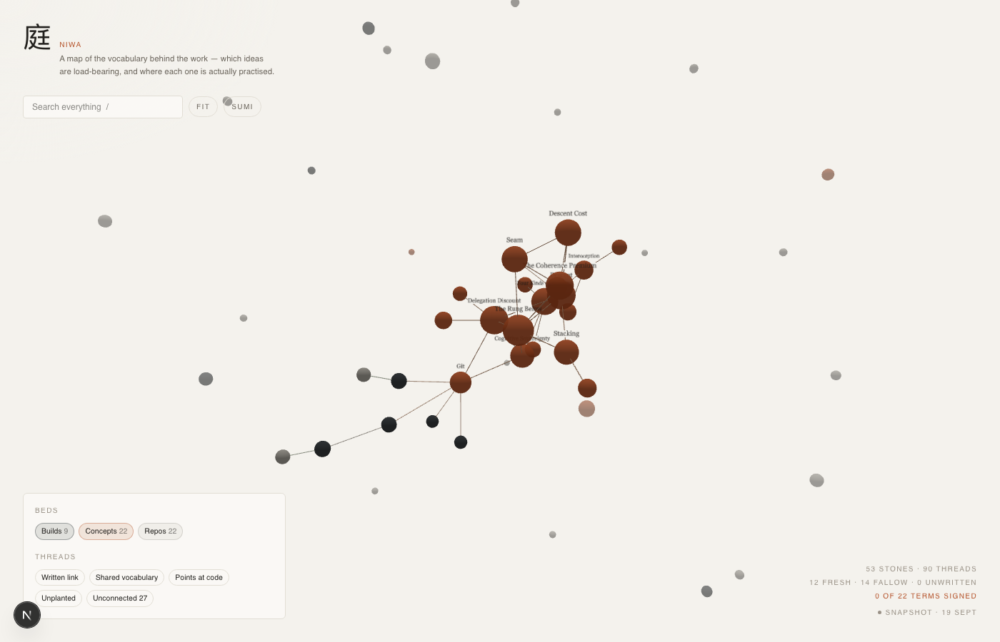

# niwa

A live 3D graph of everything you know you know — memory, vocabulary and code, drawn as one
garden.



**Local-only. Never deploy this.** It reads your memory directory, your vault and your code
tree at request time. Nothing it renders belongs on the internet.

There is a public mirror, and it is a different artefact. The live garden stays on the machine
that made it. A separate build bakes a snapshot that keeps the topology and discards the
strings: only concepts you wrote yourself, repositories that are already public on GitHub, and
sites with a live public URL survive, each carrying the text that was already public rather
than anything read off disk. `content/public.ts` is the allowlist, `lib/publish.ts` is the
projection and the tripwire audit, and `scripts/deploy-public.sh` re-bakes, re-audits and
refuses to ship an artefact that is not marked public or that still holds a private node kind.
That snapshot is what `niwa-public.vercel.app` serves, and it is what the picture above shows.

## What it reads

| Source                                              | Becomes                                                |
| --------------------------------------------------- | ------------------------------------------------------ |
| `~/.claude/memory`                                  | builds, rules, self, reference, routines, root, agents |
| `~/Fieldnotes/Glossary`                             | concepts — with `status: mine` surfaced as _signed_    |
| `~/Fieldnotes/{Ideas,Sources,Course,People}` + root | fieldnotes                                             |
| `~/Code/*`                                          | repos                                                  |

Each of the three roots is an environment variable — `NIWA_MEMORY_DIR`, `NIWA_VAULT_DIR`,
`NIWA_CODE_DIR` — so the instrument points at whatever directories are yours.

It reads them, and that is all it does to them. The only file it ever writes is
`data/garden.json`, the baked snapshot, and only when you run the snapshot script. Nothing is
cached to disk and there is no build step: `/api/garden` re-reads and re-derives on every
request, memoised only against file mtimes.

Nothing leaves the machine. No telemetry, no analytics, no error reporting, no fonts or
scripts fetched from a CDN at page load — loading the garden makes requests to its own origin
and to nowhere else. `SECURITY.md` says how that was checked and how to report a leak.

## Prerequisites

Node 25 and pnpm 10. Node 25 is required, not preferred: tests and scripts run TypeScript
directly through `--experimental-strip-types`.

## Run

```bash
pnpm install
pnpm dev     # 127.0.0.1:5050
pnpm test    # typecheck, then the tests — this is the proof
```

On macOS, to keep it up at login instead of running it by hand:

```bash
./scripts/install-launchd.sh
```

That fills the LaunchAgent template with your home directory, this clone's path and your
`node`, writes `~/Library/LaunchAgents/com.param.niwa.plist` and starts it. `scripts/README.md`
covers stopping, restarting and the log.

## Four kinds of thread

A written link is one of several ways two things can be related, so the graph draws all four:

- **Written link** — an explicit `[[wikilink]]`, resolved across the four slug styles actually
  in use (`project_suji`, `project-suji`, `suji`, `suji.md`)
- **Shared vocabulary** — a glossary term appearing literally in a note: where an idea is
  _practised_, not merely defined. Multi-word terms match case-insensitively; a single word
  must be capitalised, or ordinary words like `keep`, `edge` and `still` poison everything
- **Points at code** — a note naming a `~/Code/x` path that exists on disk
- **Unplanted** — a wikilink pointing at nothing. These render as hollow **ghost stones**: the
  idea is real enough to link to, and has never been written down

## Reading the garden

Stone size is degree. Colour is kind. Opacity and the four stages (fresh / tended / settled /
fallow) come from when the file was last touched — a fallow bed is a real signal, not a defect.

`/` focuses search · `esc` clears · **fit** re-frames the connected ontology · **paper / sumi**
switches theme. Hover a stone for its card; click it to open it, and follow its links from the
reader. The reader keeps the path you walked (`walked A › B › C`) and draws it on the map; a
step returns there, and `[` steps back one. Hold `⇧` and draw a ring round stones to gather
them: the ring is inked, the stones inside are listed, the rest dim.

The garden is drawn by hand. Every border, ring, underline and strike comes from one seeded
generator (`lib/hand.ts`), so the same line is drawn every time, and every line is a pressed
ribbon rather than a ruled stroke. Stones are discs drawn on paper, inked round the edge and
hatched away from the light; threads are pen lines that bow a little; the marginalia are in
a hand face. The marks have a grammar: an
underline is *which one* (view, group, sort), a ring is *these* (beds chosen in the
catalogue), a strike is *not these* (filters switched off in the garden).

## The catalogue

`/catalogue` is the same garden as a searchable table, one row per note: search reads
every word and shows the sentence it matched, rows group by bed, section or stage and sort by
place, title, date or threads, and the state lives in the URL. Nothing in it is shown on its
own. Above the table, **the whole** draws every note as one mark, bed by bed, and lights only
what the current search and filters are showing. Opening a row gives its page the path down to
it, its place among its siblings, a sentence on what its threads reach, and the same field with
this note, its neighbours and its family lit. **in the garden** flies the 3D view to it.

`⌘K` or `/` searches · `↑` `↓` move · `enter` opens · `esc` closes. In the Mac app, `⌘1` is the
garden, `⌘2` the catalogue, `⌘3` the bearing, `⌘4` the distribution, `⌘5` the flow, `⌘6` the course, `⌘7` the chronology, `⌘[` goes back.

## The bearing

`/bearing` is the reader's values drawn as overlapping circles on one sheet, after
the interactive Venn on paramv.com. Hover a value to flood it, click to hold it; the cursor
prints which set it is in. Type a decision and drag its stone to where you judge it sits —
the sheet reads that placement back: `d ∈ T ∩ P`, the name you gave that region, which
values it is silent on, and the stones in the garden about each value it touches. Draw
where it leads and the reading says what it gains and leaves. It surfaces; it never scores.

Values are yours: `values.json` in `niwa-vault/content/bearing/` (or `NIWA_BEARING_DIR`),
five or three of them with blurbs, the terms that mark a note as being about each, a hue,
and names for the regions — edited on the desk (**edit**) or by hand, same file. Each
decision is kept as one markdown file beside it, with the trail of where it used to sit.
Double-click the sheet to set a stone down where you point; arrow keys nudge it. `⌘3` in
the Mac app.

## The distribution

`/distribution` draws the garden's own taste as a curve, after the second figure on
paramv.com — except this curve is measured. Every stone with text is placed by its
kinship (how alike its eight nearest stones are, on shared words) and standardised against
the garden's spread, so μ is your middle and the tails are yours: the left is "little here
is like it", the right is "the garden is already full of this". Hover a mark to name it;
click a σ band to list what lives there. Paste a title and a line of something you are
about to read — or a link, read on your press — and it drops onto the curve at its place,
against everything and against lately, with its kin, the words they share, and the
glossary terms it speaks. Record "let it in" or "pass" and the choice is kept as a file,
drawn as a tick under the axis. It is a position, never a grade.

## The flow

`/flow` is the third figure on paramv.com — the influence graph — drawn from the garden's
own threads instead of a hand-picked eleven. Every thread is given the direction writing
gave it: a note that links to, names or seeds a thing was fed by it. Put any stone at the
centre and what flowed into it fans out to the left by hop, what it flowed into to the
right; arrows that run both ways are in the accent, fallow roots are hollow, unwritten
ones dashed. The reading says what the stone rests on, which of its roots have gone
fallow since, which were never written, which single root is a linchpin, what loops back,
and what would move if it changed. Click a stone to walk to it; `[` walks back. It reads
structure; it never grades it.

## The course

`/course` is the fifth figure on paramv.com — the breakout where the ball is a belief and
every brick bends it — with the site's own audit answered: the bricks are grey until you say
what each was worth. Put a belief on the sheet and everything that flowed into it lies across
it in the order it came; mark an input _toward_ the question or _away_, after the fact, and
the pen redraws the course your marks imply. The question runs along the top and keeps its
earlier phrasings when you re-put it. The desk counts, says what kind of thing did the
bending and what has hit the belief since you last rewrote it, and lists what has arrived
lately that speaks its words. Marks are kept as files in the vault. It holds your judgment;
it never makes it.

## The chronology

`/chronology` is the number line from [chronology](https://github.com/pvcomms/chronology)
moved into the garden. Your life as a line: the inner life above it, the world below, in lanes
you name; over them the conditions you lived under — what was simply the case, the weather of
the era, the dated public events — and, hatched, the stretches the record does not speak for.
A day is a mark sized by how large it looms; a stretch is a bar; a day you only know to the
year is placed at its middle and drawn with a whisker, honestly. Two scales: the clock, and the
proportional one where a year at seven is wider than a year at thirty-seven. Drag the present
back and the desk reads the record as it stood. Double-click to set something down, drag to
re-date it, bind it to stones. Under the lanes, every day your own notes speak of. Everything
is a file in the vault. It counts and says what was so; it does not grade a life.

## It moves on its own

`/api/watch` is server-sent events over `fs.watch`, with a 15-second poll as backstop. A write
anywhere in memory or the glossary refetches and the graph grows **in place** — node objects
are reused, so the simulation keeps its positions and only new stones drift in. Memory
auto-commits hourly and seven scheduled agents write into it, so this happens unattended.
The colophon says `watching disk` until it does, then `the garden moved`.

## Part of the constellation

niwa is one instrument of several built under the Center for Applied Post-Phenomenology
([postphenom.com](https://postphenom.com)), which asks what a tool does to the thing it
measures. The published siblings are [kiku](https://github.com/pvcomms/kiku), which reads
anything readable aloud on your own machine, and
[interactive-venn-template](https://github.com/pvcomms/interactive-venn-template), and
[chronology](https://github.com/pvcomms/chronology), whose number line now also lives here as
`/chronology`. terra-cognita is still local and unpublished. They share a set of rules
rather than any code: personal data stays on the machine that made it, flat files are the
database, and the tool surfaces rather than decides — nothing here ranks a person's ideas for
them or tells them what to write next.

## Contributing

`CONTRIBUTING.md` for how work is specified and what the privacy rules are. `AGENTS.md` is the
contract for a coding agent, `docs/ARCHITECTURE.md` is the map, and `docs/features/` holds one
file per piece of work.

## License

MIT. See `LICENSE`.
